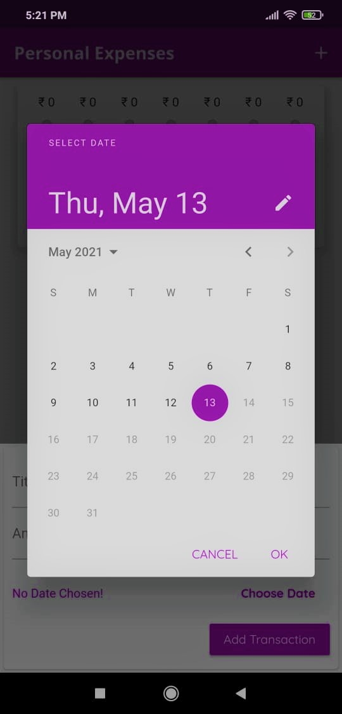

# Personal Expenses

It is a cross-platform app for keeping track of personal expenses. It has a number of features, including a bar chart that shows the spending ratio over the last seven days. This is a demo app, so it doesn't have the feature to store data.

# Features

- Beautiful and user-friendly UI
- Custom build bar chart
- Easy to use functions

# App Screenshots

&nbsp;&nbsp;&nbsp;&nbsp;&nbsp;&nbsp;&nbsp; &nbsp;&nbsp;&nbsp;&nbsp;&nbsp;&nbsp;&nbsp;
